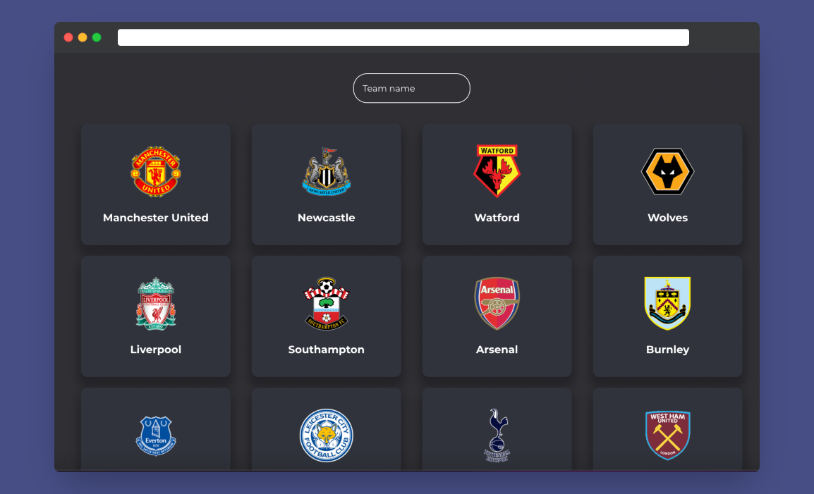
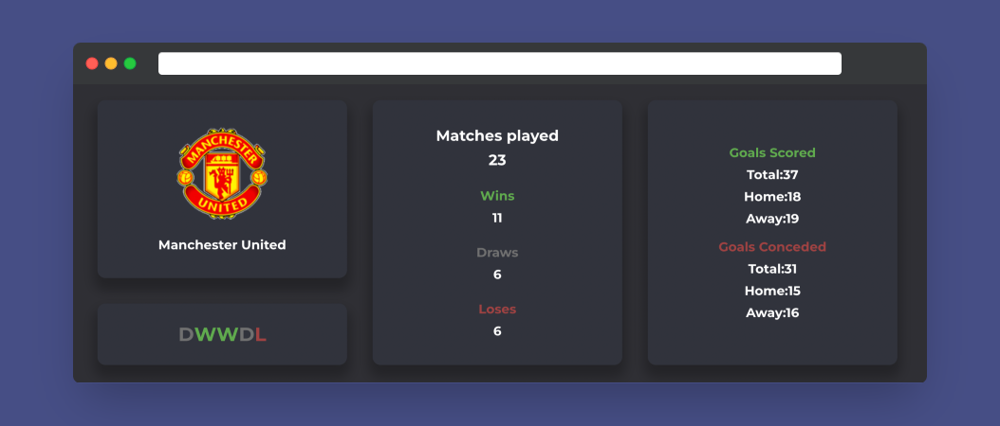

# Premstats

> This is a web app that displays current stats of your favorite Premier League team.

## Built With

- ReactJS

## Technologies used

- Redux
- React Router
- Sass
- React Testing Library

## Live Demo

[Live Demo Link](https://spacetravelerhub.netlify.app/)

## Getting Started

To get a local copy up and running follow these simple example steps.

### Prerequisites

To run the project on your local machine you need to have:

- bash cli.
- npm.

### Setup

Go to the terminal and type:

- `git clone https://github.com/Marcraphael12/Space-traveler-s-hub.git [YOUR_PROJECT_NAME]`
- `cd [YOUR_PROJECT_NAME]`
- `npm install`

### Usage

To start a local server on port 3000 run:

- `npm start`

## Authors

👤 **Anuar Shaidenov**

- GitHub: [@anuarshaidenov](https://github.com/anuarshaidenov)
- Twitter: [@anuarnyi](https://twitter.com/anuarnyi)
- LinkedIn: [anuarshaidenov](https://linkedin.com/in/anuarshaidenov)

## 🤝 Contributing

Contributions, issues, and feature requests are welcome!

Feel free to check the [issues page](../../issues/).

## Show your support

Give a ⭐️ if you like this project!

## 📝 License

This project is [MIT](./MIT.md) licensed.
